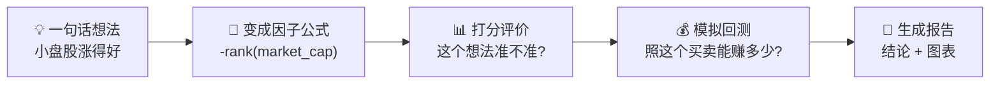
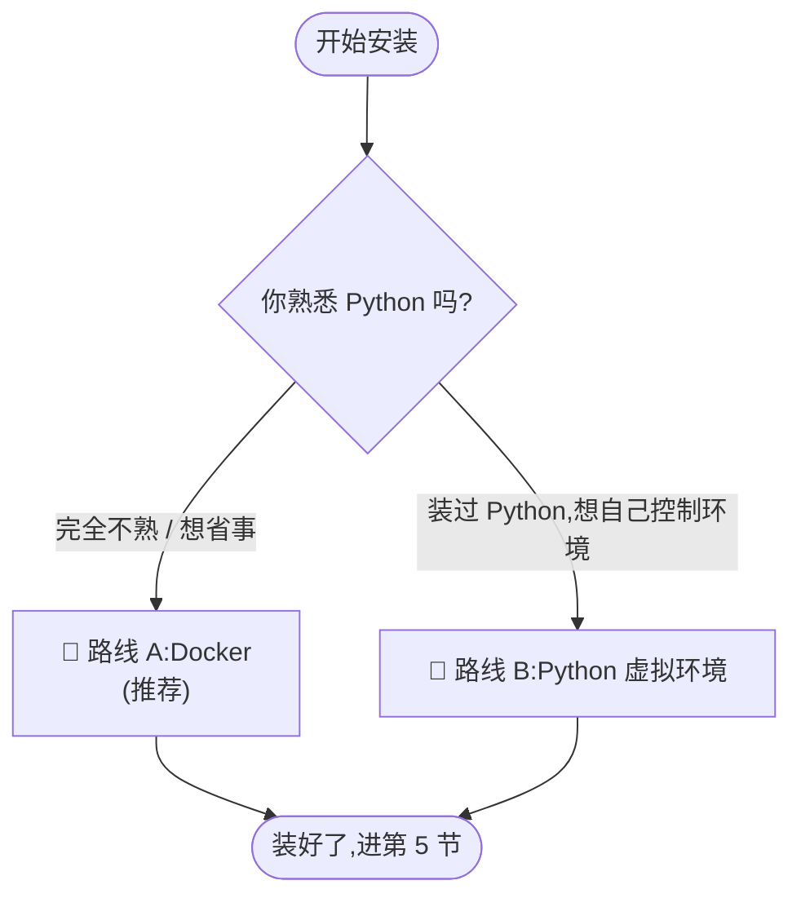
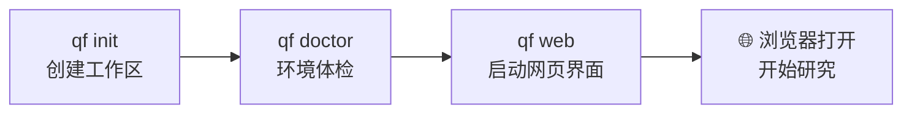
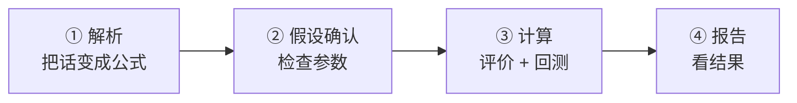
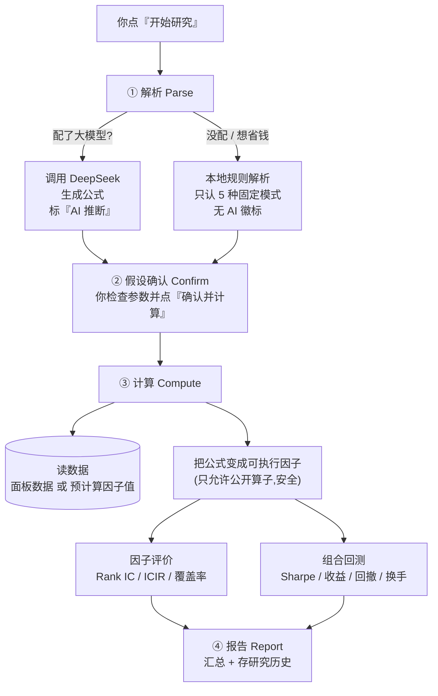
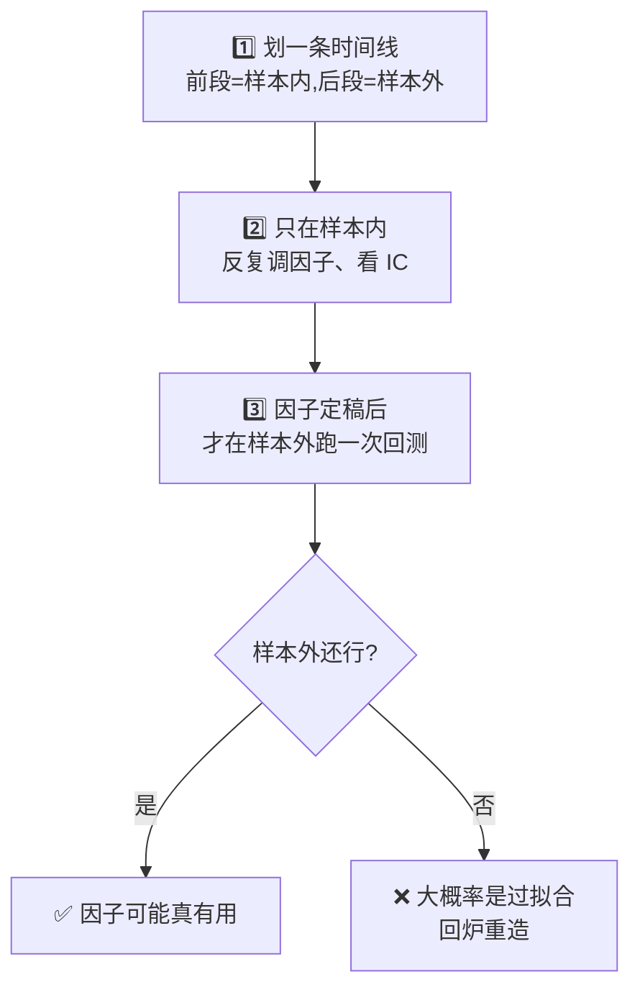
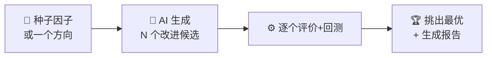

# Quant Forge OpenSource · 新手入门指南

> 从 0 开始,一步步跑通你的第一个量化因子,并**真正看懂系统在背后做了什么**。
> 本指南面向**完全没有基础**的读者 —— 不需要你会编程、也不需要你懂量化,跟着做就行。
> 文中所有界面文字、指标、数值都来自对当前版本的**真实实操**,不是示意。

---

## 目录

1. [这个软件是干什么的](#1-这个软件是干什么的)
2. [先搞懂 7 个词(零基础必读)](#2-先搞懂-7-个词零基础必读)
3. [准备工作:你需要什么](#3-准备工作你需要什么)
4. [安装:两条路,任选一条](#4-安装两条路任选一条)
5. [第一次启动 & 控制令牌](#5-第一次启动--控制令牌)
6. [界面导览:每个地方是干嘛的(含模式切换真相)](#6-界面导览每个地方是干嘛的含模式切换真相)
7. [实战:挖出你的第一个因子](#7-实战挖出你的第一个因子)
8. [⭐ 幕后揭秘:点"开始研究"后系统到底做了什么](#8--幕后揭秘点开始研究后系统到底做了什么)
9. [看懂结果:每个指标怎么读(中英对照)](#9-看懂结果每个指标怎么读中英对照)
10. [进阶:样本内 vs 样本外](#10-进阶样本内-vs-样本外)
11. [进阶:接入 AI,用一句话生成因子](#11-进阶接入-ai用一句话生成因子)
12. [进阶:让 AI 自动帮你挖因子(RD)](#12-进阶让-ai-自动帮你挖因子rd)
13. [新手最容易卡住的 8 个点](#13-新手最容易卡住的-8-个点)
14. [常见问题](#14-常见问题)
15. [附录 A:命令速查表](#附录-a命令速查表)
16. [附录 B:术语表(中英对照)](#附录-b术语表中英对照)
17. [许可证说明](#许可证说明)

---

## 1. 这个软件是干什么的

一句话:**它帮你把"选股想法"变成"可以验证的因子",并在历史数据上检验这个想法到底有没有用。**

举个例子。你有一个直觉:"小盘股比大盘股涨得好"。Quant Forge 能帮你:



**它能做的:**

| 能力 | 说明 |
| --- | --- |
| 自然语言转因子 | 输入一句话想法或一段研报文字,自动变成因子公式 |
| 本地数据验证 | 在你自己电脑上的历史数据上跑,不联网上传数据 |
| 因子评价 | 算出 Rank IC、ICIR、覆盖率等"这个因子准不准"的指标 |
| 轻量回测 | 模拟"照这个因子买卖"的收益、回撤、换手 |
| 样本内/样本外 | 自动区分"用来研究的数据"和"用来验货的数据" |
| RD 研究循环 | 让 AI 自动生成多个改进版因子,挑出最好的 |
| 本地 Web 界面 + 命令行 | 两种用法,新手推荐用 Web 界面 |
| Markdown 研究报告 | 每次研究自动存一份报告 |

**它刻意不做的**(重要,别误会):

> ❌ 不含实盘交易、不下单、不连券商、不含托管服务、不含非公开数据源、不含账户体系。
>
> 这是一个**研究工具**,帮你验证想法。界面上也会反复提醒:**"研究口径,不是生产交易口径。"**

---

## 2. 先搞懂 7 个词(零基础必读)

量化听起来吓人,其实核心就这几个概念。花 5 分钟看懂,后面全通。

### ① 因子(Factor)

**一个给股票打分的公式。** 分数高的股票"应该"表现好,分数低的"应该"表现差。

> 例:`-rank(market_cap)` 意思是"市值越小,分数越高" —— 这就是"押小盘股"这个因子。
> `rank(...)` 是"横截面排名",前面加 `-` 表示"反过来"(越小越靠前)。

### ② 面板数据(Panel Data)

**一张大表格:每天、每只股票、每个字段一行。** 这是所有计算的原料。

```
trade_date（日期）  instrument（股票）  close（收盘价）  market_cap（市值）  is_st（是否ST）
2025-01-02          000001            12.3           1.2e11            0
2025-01-02          000002            8.7            9.8e10            0
...
```

软件自带一份**演示数据**,你不用自己准备,开箱即用。

### ③ Rank IC（信息系数)

**衡量"因子打的分" 和 "股票之后实际涨跌" 的相关性。** 数值在 -1 到 1 之间。

- 越接近 0 → 因子和涨跌没关系(没用)
- 越大(正或负)→ 因子越有预测力
- 一般 |Rank IC| > 0.03 就算有点东西了(真实例子里我们会看到 0.088)

### ④ ICIR

**Rank IC 的稳定性 = IC 均值 ÷ IC 的波动。** IC 高还不够,还得每期都稳定地高,ICIR 才高。

### ⑤ Sharpe(夏普比率)

**衡量"每承担一份波动风险,能换来多少收益"。** 回测里最常看的一个数。

- Sharpe < 0 → 亏钱
- Sharpe ≈ 1 → 不错
- Sharpe > 1.5 → 很好(但要警惕"过拟合",见第 10 节)

### ⑥ 回测(Backtest)

**用历史数据模拟"如果当时照这个因子买卖,现在赚多少"。** 输出收益、最大回撤、换手率等。

### ⑦ 样本内 / 样本外(In-Sample / Out-of-Sample)

**这是量化最重要的纪律。**

- **样本内(IS)**:你用来"研究、调整因子"的历史数据段。
- **样本外(OOS)**:你**故意留着不看**、最后才用来"验货"的数据段。

> 为什么?因为在同一段数据上"反复调到最好",很容易调出一个**只对这段历史有效、换个时间就失灵**的假因子(叫"过拟合")。样本外就是照妖镜 —— 真有用的因子,在没见过的数据上也该有效。

**记住这一条,你就超过了一半的量化新手。** 第 10 节会用一个真实例子让你看到"样本内漂亮、样本外翻车"长什么样。

---

## 3. 准备工作:你需要什么

| 需要 | 说明 |
| --- | --- |
| 一台电脑 | macOS、Linux 或 Windows 都行 |
| Docker Desktop **或** Python 3.11+ | 二选一,下一节详解。**新手强烈推荐 Docker** |
| 一个浏览器 | Chrome / Edge / Safari 都行,用来打开 Web 界面 |
| (可选)一个大模型 API Key | 想用"任意一句话生成因子"才需要,见第 11 节。**不配也能用**(会退化成本地规则解析,只认识几种固定模式) |

> 💡 **完全不懂命令行也没关系。** 下面每条命令都可以直接复制粘贴。命令行就是一个"输入指令、回车执行"的黑框:Mac 上叫"终端 Terminal",Windows 上叫"PowerShell"。

---

## 4. 安装:两条路,任选一条



### 路线 A:Docker(推荐新手)

Docker 会把整个运行环境打包好,你不用操心 Python 版本、依赖冲突这些破事。

**第 1 步**:安装 Docker Desktop(官网下载,一路下一步)。

**第 2 步**:下载本项目代码。在终端里:

```bash
git clone https://github.com/agenthaulk/quant_forge_opensource.git
cd quant_forge_opensource
```

**第 3 步**:构建镜像(第一次会慢几分钟,泡杯茶):

```bash
docker build -t quant-forge .
```

**第 4 步**:启动。这条命令会顺便生成一个随机"控制令牌"(见第 5 节):

```bash
export QF_WEB_CONTROL_TOKEN="$(python3 -c 'import secrets; print(secrets.token_urlsafe(24))')"
docker run --rm -p 127.0.0.1:8765:8765 -e QF_WEB_CONTROL_TOKEN quant-forge
```

看到 `listening on http://0.0.0.0:8765` 就成功了。**打开浏览器访问 `http://127.0.0.1:8765/`**。

> ⚠️ 如果 8765 端口被占用,把命令里改成 `-p 127.0.0.1:8876:8765`,然后访问 `http://127.0.0.1:8876/`。

### 路线 B:Python 虚拟环境

如果你装过 Python,想直接在本机跑:

```bash
git clone https://github.com/agenthaulk/quant_forge_opensource.git
cd quant_forge_opensource

python3 -m venv .venv
source .venv/bin/activate          # Windows 用: .venv\Scripts\activate
python3 -m pip install -e ".[dev]"
```

> 📌 支持 Python 3.11 及以上,推荐 3.12。安装依赖报错时,试试精确复现测试基线:
> `python3 -m pip install -e ".[dev]" -c constraints.txt`

装完后,`qf` 命令就可用了。验证:`qf --help`。

> 不想"安装包"的话,可以用 `PYTHONPATH=src python3 -m quant_forge.apps.cli.main` 代替 `qf`。

---

## 5. 第一次启动 & 控制令牌

先用命令行把演示工作区跑起来,确认环境没问题。**这几条是"体检 + 打开界面"。**



路线 B / 本机 Python 用户,在项目目录里依次执行:

```bash
# 1. 创建演示工作区(生成 ./qf-demo 文件夹,内含示例数据和因子)
qf init --workspace ./qf-demo

# 2. 环境体检:检查数据、配置、依赖是否都 OK
qf doctor --workspace ./qf-demo

# 3. 启动本地网页界面
qf web --workspace ./qf-demo --rd-config configs/rd.yaml
```

第 3 步会打印一个本地地址(通常 `http://127.0.0.1:8765/`),在浏览器打开它。

> Docker 路线 A 的用户:上一节 `docker run` 已经帮你做完了这些,直接打开浏览器即可。

### 🔑 关于"控制令牌"(很多人卡在这)

打开网页时,**有的人会弹出一个"请输入本次 Web 控制令牌"的对话框,有的人不会** —— 这不是 bug,取决于服务怎么启动的:

| 启动方式 | 会不会要令牌 | 为什么 |
| --- | --- | --- |
| **Docker**(绑定 `0.0.0.0`) | ✅ 会弹窗要令牌 | 服务对局域网可见,必须用令牌保护 |
| **本地 `127.0.0.1`** 直接跑 | ❌ 不弹窗,直接进 | 只有本机能访问,不需要令牌 |

如果弹窗要令牌:**把启动时 `QF_WEB_CONTROL_TOKEN` 那个值粘进去,点 OK**(想看它的值,先运行 `echo $QF_WEB_CONTROL_TOKEN`)。令牌只存在你的浏览器里,输一次就行。

> ⚠️ 这个令牌框是浏览器的**原生弹窗**,只在你第一次点"需要保护的操作"(如"开始研究")时才弹,不是页面加载就弹。在令牌输入前,界面底部会显示 `protected` / `需要控制令牌`,输完就正常了。

**看到界面了?恭喜,最难的一步过了。**

---

## 6. 界面导览:每个地方是干嘛的(含模式切换真相)

### 🎭 模式切换:简洁模式 / 专家模式(先说清,否则你会困惑)

打开网页,**顶部正中间**有两个按钮:**`简洁模式`** 和 **`专家模式`**。默认是**简洁模式**。

```
┌─────────────────────────────────────────────┐
│            [简洁模式] [专家模式]  ← 顶部正中     │
└─────────────────────────────────────────────┘
```

- **简洁模式**:一张居中的大卡片,只有"输入想法 + 开始研究",没有侧边栏。适合新手。
- **专家模式**:切换成**双栏 dashboard** —— 左边侧栏(解析/研究控制、运行状态),右边 7 个功能标签页。适合看细节、调参数。

**这两个按钮是好用的,点了会整页切换。** 如果你觉得"点了没反应",几乎可以肯定是下面这个坑 👇

> ⚠️ **有两个长得像的"简洁/专家"按钮,别搞混!**
>
> | 位置 | 按钮文字 | 作用 |
> | --- | --- | --- |
> | **顶部正中** | `简洁模式` / `专家模式` | 切换**整个页面布局**(卡片 ↔ dashboard),变化很大 |
> | **因子卡片内部**(研究进行时) | `简洁` / `专家`(没有"模式"二字) | 只切换**这张卡片显示多少细节**,变化很小,像"没反应" |
>
> 如果你点的是卡片里那个 `简洁`/`专家`,看起来几乎不变是**正常的** —— 它只控制卡片信息密度。想切整页布局,请点**顶部正中带"模式"二字**的那对。

### 顶部 7 个功能标签页

进入**专家模式**后,顶部一排标签(从左到右),都是真实标签文字:

`LLM 因子工作台` · `研究历史` · `数据` · `已注册因子` · `文档` · `扩展` · `记忆治理`

| 标签页 | 里面有什么 |
| --- | --- |
| **LLM 因子工作台** | 主战场。下面还分两个子标签:**`单因子研究`** 和 **`多因子策略回测`** |
| **研究历史** | 你每次跑过的研究,都自动记这里,可回看对比(标题写着"run index 最近运行记录") |
| **数据** | "数据控制台" —— 一张字段目录表,列出 `close`/`market_cap`/`is_st`(必需)、`volume`/`return_1d` 等(可选),下面有"质量门结果"绿灯 `ok` |
| **已注册因子** | 因子库 —— 所有已注册因子的卡片(名称 · 因子ID · 持有天数 · 状态 · 公式) |
| **文档** | 内置说明文档 |
| **扩展** | 可选扩展模块 |
| **记忆治理** | 进阶:系统从历次研究沉淀的"经验规则",可人工审核 |

---

## 7. 实战:挖出你的第一个因子

我们完整走一遍。目标:验证"小盘股涨得好"这个想法。

### 在简洁模式里(最简单)

1. 保持在**简洁模式**(默认)。你会看到一张卡片,标题 **`一句话,开始研究`**。
2. 中间的输入框里**已经预填了一句示例**:`非ST的小市值股票未来表现更好`。
   > 这是可以编辑的示例文字。你可以直接用它,也可以清空改成自己的想法。
3. 下面 **`试试:`** 一行有 3 个示例按钮(点一下自动填入):

   | 按钮 | 填入的想法 |
   | --- | --- |
   | `非ST 小市值` | 非ST的小市值股票未来表现更好 |
   | `短期动量` | 过去5天涨幅较大的股票,短期动量继续 |
   | `低估值` | 估值越低的股票,长期收益越好 |
4. 点绿色大按钮 **`开始研究`**。
5. 页面会自动切到**专家模式 → LLM 因子工作台 → 单因子研究**,并启动一条"研究流水线"。

### 你会看到 4 个阶段依次点亮

顶部有一个 4 步进度条,真实文字是:



- **① 解析**:系统把你的话变成因子公式。侧栏显示 `解析完成,等待确认参数`。
- **② 假设确认**:出现一张"确认因子假设"卡片(badge `待确认`),列出因子定义和所有参数(下一节详解每个字段)。
- **③ 计算**:badge 变 `计算中`,标题"正在评测与回测"。这里会提示:
  > `本次运行使用确认时冻结的参数;下方编辑只会保存为下一次尝试,不会改变本次运行。`
- **④ 报告**:badge 变 `已完成`,标题"报告已生成",出现全部指标结果。

**下一节我们逐帧拆解这 4 步里系统到底做了什么** —— 这是理解整个软件的关键。

---

## 8. ⭐ 幕后揭秘:点"开始研究"后系统到底做了什么

这一节回答几个新手最想问的问题:**系统跑了哪些步骤?调没调大模型?数据从哪来?因子怎么建出来的?那堆结果怎么算的?**

### 全景图



### 阶段 ① 解析:调大模型,还是本地规则?

**这是最关键的分叉。系统有两种方式把你的话变成公式:**

| 方式 | 什么时候用 | 认识什么 | 怎么判断用了哪个 |
| --- | --- | --- | --- |
| **大模型(LLM)语义解析** | 配了 DeepSeek key(第 11 节) | 任意自然语言 | 结果卡片上有 **`AI 推断`** 徽标 |
| **本地规则解析** | 没配 key,或选了本地模式 | **只认 5 类固定模式** | **没有** `AI 推断` 徽标 |

**本地规则只认识这几类**(其它话它认不出来):

- 小盘 / 市值 → `-rank(market_cap)`
- 动量 / 短期反转 → 基于收益率
- 低波动 → `-rank(volatility_5d)` 之类
- 成交量 / 流动性 → `rank(volume)`
- 以及上面几种的组合

> 🔍 **怎么知道到底调没调大模型?看徽标。**
> - 公式旁边有 **`AI 推断`** → DeepSeek 真的被调用了。
> - 没有徽标 → 是本地关键词解析器认出来的。
> - 如果**没配 key 又不匹配任何固定模式**,系统会**明确报错**,而不是偷偷编一个公式糊弄你 —— 这是有意的诚实设计。

真实例子:输入"非ST的小市值股票表现更好",配了 DeepSeek,得到公式 **`-rank(market_cap)`**,并标注 `AI 推断`。

### 阶段 ② 假设确认:每个字段什么意思 + 徽标图例

确认卡片("确认因子假设")会列出**全部参数**,每个都带一个"来源徽标"。真实字段如下:

| 分组 | 字段 | 示例值 | 徽标 |
| --- | --- | --- | --- |
| **因子定义** | 因子名称 | `small_cap_non_st` | `AI 推断` |
| | 公式 | `-rank(market_cap)` | `AI 推断` |
| | 说明 | 非ST的小市值股票表现更好 | `AI 推断` |
| | 预测周期 | `21天` | `AI 推断` |
| **股票池** | 股票池筛选 | `is_st == false`(排除 ST 股) | `用户明确指定` |
| **持有与执行** | 持有期 / Delay / Decay / Top Quantile | `21天 / 1天 / 0天 / 0.3` | `默认配置` |
| **评测区间** | 评测开始 / 结束 | `2025-01-01 / 2025-12-31` | `默认配置` |
| **回测区间** | 回测开始 / 结束 | `2026-01-01 / 未设置` | `默认配置` / `固定策略` |
| **交易成本** | 手续费 / 滑点 / 融券成本 | `0bps / 0bps / 0bps/年` | `默认配置` |

**徽标图例(界面里没有说明,这里补上):**

| 徽标 | 含义 |
| --- | --- |
| **`AI 推断`** | 这个值是大模型根据你的话猜的 |
| **`用户明确指定`** | 这个值是你的话里明确要求的(如"非ST"→排除 ST) |
| **`默认配置`** | 系统默认值,你可以改 |
| **`固定策略`** | 系统按规则自动决定,**你改不了**(如"回测结束:未设置=按可用数据自动到最新") |

> 💡 看到 **`回测结束:未设置(按可用数据自动解析)`** 不要慌 —— 这**不是错误**,意思是"自动用到最新一天的数据"。

底部两个按钮:**`确认并计算`**(绿色,继续)/ **`放弃本次研究`**(红色,取消)。点"确认并计算"进入下一步。

### 阶段 ③ 计算:数据从哪来 + 因子怎么建 + 怎么评价回测

点"确认并计算"后,系统在几秒内做完三件事:

**(a) 读数据 —— 从哪来?**

| 因子类型 | 数据来源 |
| --- | --- |
| **公式因子**(如 `-rank(market_cap)`) | 读本地**面板数据**(那张日期×股票×字段的大表),按公式**当场算**出每天每只股票的因子值 |
| **预计算因子**(公式是 `precomputed:...`) | 直接读事先算好、存在磁盘上的**因子值**,不再计算 |

面板数据最少要有这几列:`trade_date, instrument, close, market_cap, is_st`(演示工作区自带一份,离线可用)。

**(b) 把公式变成"可执行因子" —— 安全吗?**

系统只允许一份**公开算子白名单**(`rank`、`ts_sum`、`ts_std_dev`、`ts_delta`、`ts_corr` 等)。你的公式必须只用这些算子,否则**在校验阶段就被拒绝,根本不会执行**。

> 🔒 这就是为什么"用自然语言生成公式"是安全的 —— 任何奇怪的、想搞破坏的东西都过不了算子白名单这一关。

算好的因子会存成一个 `factor.yaml`(在因子库 `factor_root` 里),包含名称、公式、预测周期等。

**(c) 评价 + 回测**(下一节详细解读每个数字):
- **评价**:算 Rank IC、ICIR、覆盖率等 —— 回答"这个因子准不准"。
- **回测**:模拟"买因子分数最高的一批、卖最低的一批"(次日成交、持有 N 天、扣交易成本)—— 回答"照这个买卖赚不赚"。

### 阶段 ④ 报告:结果 + 存档

系统把因子定义、评价指标、回测结果汇总成报告,同时:
- 在界面右侧展开一排结果子标签:`概览` · `样本内评价` · `样本内回测` · `样本外评测` · `诊断` · `研究证据` · `Artifacts` · `Benchmark 对比`。
- 把这次运行写进**研究历史**(持久保存,以后能回看)。
- 在工作区 `artifacts/research_reports/` 下存一份 Markdown 报告。

---

## 9. 看懂结果:每个指标怎么读(中英对照)

界面里指标是**中英混着来**的,对新手不友好。这里给一张对照表,并用一次**真实运行结果**逐个解读。

真实例子:小盘因子 `-rank(market_cap)`,样本内 2025 年、样本外 2026 年初。

### 样本内评价(因子准不准)

| 界面标签 | 中文 | 真实值 | 怎么读 |
| --- | --- | --- | --- |
| `Rank IC` | 信息系数 | **0.0881** | 预测力。>0.03 算有料,0.088 相当不错 |
| `ICIR` | IC 稳定性 | **0.53** | IC 的稳定程度,越高越可靠 |
| `HAC t-stat` | 统计显著性 | **2.12** | >2 一般认为"不是碰运气",有统计显著性 |
| `IC Days` | 有效天数 | **221** | 用了多少个交易日算 IC |
| `Joint Coverage` | 联合覆盖率 | **97.15%** | 有多少股票能算出因子值,越接近 100% 越好 |
| `Horizon / Delay` | 预测周期 / 延迟 | **21日 / 1日** | 预测未来 21 天,信号延迟 1 天成交 |

### 样本内组合回测(照这个买卖赚不赚 —— 样本内)

| 界面标签 | 中文 | 真实值 | 怎么读 |
| --- | --- | --- | --- |
| `净累计收益` | 扣成本后总收益 | **29.00%** | 整段时间总共赚了多少 |
| `可报告净年化收益` | 年化收益 | **32.02%** | 折算成一年赚多少 |
| `年化Sharpe` | 夏普比率 | **1.90** | 每份风险换多少收益,>1.5 很漂亮 |
| `净值最大回撤` | 最大回撤 | **-10.60%** | 最惨从高点跌了 10.6% |
| `Rebalance Turnover` | 调仓换手率 | **11.28%** | 每次调仓换掉约 11%,不算高 |

### ⚠️ 外部样本外评测(照妖镜 —— 样本外)

| 界面标签 | 中文 | 真实值 | 怎么读 |
| --- | --- | --- | --- |
| `净累计收益` | 扣成本后总收益 | **-8.88%** | **样本外反而亏了!** |
| `年化Sharpe` | 夏普比率 | **-1.41** | **由正转负** |
| `净值最大回撤` | 最大回撤 | **-12.49%** | 回撤更大 |

> 🎯 **这就是活生生的教训。** 样本内 Sharpe **1.90**(漂亮得不行),换到样本外直接变 **-1.41**(亏钱)。如果只看样本内就上,实盘会血本无归。
>
> 更棒的是:**系统自己在"诊断"标签里诚实地警告了你** —— 会打出 `IS ICIR 明显强于 OOS,不要只依赖全样本指标` 之类的提示,以及 `OVERLAPPING_IC_REQUIRES_HAC`、`INSUFFICIENT_ANNUALIZATION_HISTORY` 等诚实标签。**它不藏着掖着,这正是好研究工具该有的样子。**

### 诊断标签(为什么这些警告是好事)

| 诊断标签 | 意思 |
| --- | --- |
| `OVERLAPPING_IC_REQUIRES_HAC` | IC 有重叠,已用 HAC 方法修正统计量(更严谨) |
| `INCOMPLETE_FORWARD_HORIZON_DROPPED` | 末尾不足一个持有期的数据被丢弃(避免虚高) |
| `INSUFFICIENT_ANNUALIZATION_HISTORY` | 历史太短,年化数字不可靠,已标 n/a |
| `POSITIONS_LOST_BEFORE_EXIT` | 有持仓在到期前丢失(如退市),已如实处理 |

> 这些不是报错,是系统在**主动告诉你结果哪里要打折扣** —— 越多这类诚实标签,越说明工具靠谱。

---

## 10. 进阶:样本内 vs 样本外

第 2、9 节都强调了:这是量化最重要的纪律。现在动手实践。

**正确的研究姿势:**



在**专家模式**下,"评测区间"和"回测区间"可以分别填不同的日期段:

- 评测区间(样本内)= `2025-01-01` ~ `2025-09-30` → 在这段研究、优化
- 回测区间(样本外)= `2025-10-01` ~ `2025-12-31` → 定稿后验货

> ⚠️ 常见误区:两个区间都**留空**时,系统会用"全部可用数据"自动填,导致样本内外是**同一段** —— 这时系统会诚实标注"样本内评价为同窗诊断,非独立研究样本"。想要真正的样本外验证,**一定要显式填两段不重叠的日期**。

对于自动挖因子(RD)流程,配置文件里用 `sample_splits` 表达 IS/OOS 划分,并可用 `boundary_date` 钉住精确切分日期(而不是按比例切):

```yaml
evaluation:
  sample_splits:
    - {name: is,  fraction: 0.75, boundary_date: "2025-09-30"}  # 样本内到 9-30
    - {name: oos, fraction: 0.25}                                # 样本外 = 剩余
```

> 系统还会在样本内外的接缝处自动"隔离"(purge/embargo)几天(`延迟天数 + 预测周期`),防止未来信息泄漏到过去 —— 这些你不用手动管,但知道它在保护你。

---

## 11. 进阶:接入 AI,用一句话生成因子

不配 AI,系统只认识第 8 节那 5 类固定模式。配上大模型(如 DeepSeek),你就能用**任意自然语言**描述想法。

> 🔒 **安全原则:配置文件里只写"环境变量名",绝不写真实密钥。** 真实 Key 放在被 git 忽略的本地文件里。

**第 1 步**:复制配置模板:

```bash
cp configs/default.draft.yaml configs/default.local.yaml
```

**第 2 步**:把 API Key 放进本地 env 文件(被 git 忽略,不会上传):

```bash
printf 'DEEPSEEK_API_KEY=<你的-api-key>\n' > configs/default.local.env
chmod 600 configs/default.local.env
```

**第 3 步**:在 `configs/default.local.yaml` 里声明 provider(只写环境变量名):

```yaml
runtime:
  env_files:
    - default.local.env
llm:
  provider: deepseek
  providers:
    deepseek:
      model: deepseek-chat
      base_url: https://api.deepseek.com
      api_key_env: DEEPSEEK_API_KEY
```

**第 4 步**:验证链路(不会打印你的密钥):

```bash
qf llm-smoke --config configs/default.local.yaml --provider deepseek
```

**第 5 步**:带上这个配置启动 Web:

```bash
qf web --config configs/default.local.yaml --rd-config configs/rd.yaml
```

现在界面底部会显示 **`LLM deepseek / deepseek-chat`**,解析因子时公式旁会出现 **`AI 推断`** 徽标。

> Docker 用户:用 `docker run --env-file configs/default.local.env ...` 把密钥传进容器,同样不写进镜像。

### 另一条路:直接在网页里切换大模型 / 输入密钥

如果你不想改 YAML、也不想重启,可以直接在**专家模式**左侧控制栏里切换 provider 或临时输入密钥,即时生效:

1. **LLM Provider** 下拉会同时列出你在配置里写好的 provider **和 6 个内置预设**(`deepseek` / `openai` / `openai_compatible` / `glm` / `claude` / `minimax`)。没在 YAML 里配过的预设会标注**「预设未启用」**。
2. 把 **LLM API Key** 从「配置文件 / 环境变量加载」切到**「前端输入(注入本次运行)」**,密码框就可以编辑了。
3. 填入密钥。如果选的是**没有默认模型的预设**(如 openai / glm / claude),会多出一个**模型名**输入框要你补填;选 `openai_compatible`(本地自建模型常用)还会多出一个 **Base URL** 框(如本地 `http://127.0.0.1:11434/v1`)。
4. 点**「保存并启用」**。状态提示会显示"已保存",输入框立即清空,底部运行时状态条切换成你选的 provider。

> 🔒 **这条路的密钥只进"运行中进程的内存":不写磁盘、不在任何响应里回显、不进日志,重启就没了。** 想让密钥重启后还在,仍然要走上面第 2 步那种 `configs/*.local.env` 文件。
>
> 几个安全细节,遇到时不用慌:
> - Docker / `0.0.0.0` 启动时,这个保存操作和其它会改状态的操作一样**需要控制令牌**(见第 5 节)。
> - 想把某个**已配好的** provider 改指向新的 `base_url`(换服务地址)时,系统会要求你**在同一次保存里重新填一遍密钥** —— 这是为了防止你原有的常驻密钥被发去一个新地址,属于正常保护,不是 bug。

---

## 12. 进阶:让 AI 自动帮你挖因子(RD)

RD(Research-Development)循环 = 让 AI **自动生成多个因子候选、逐个评价回测、挑出最好的**。



命令行跑一轮:

```bash
qf research run-once FTR_DEMO_SMALL_CAP --workspace ./qf-demo --rd-config configs/rd.yaml
```

网页里进入 **LLM 因子工作台 → 多因子策略回测** 或单因子研究页,配置轮数和候选数后运行。

**几个要点:**

- RD 会输出一个 `report_path`,Markdown 报告写在工作区 `artifacts/research_reports/` 下。
- RD 耗时取决于数据量、AI 延迟、候选数。完整数据集上一轮可能几十秒到几分钟。界面超过 10 秒会显示长任务提示,并给一个**中断按钮**(在安全阶段边界生效)。
- 如果 AI 连续给出非法公式,系统会把错误回传给 AI 做有限次修复;若最终只是复用种子、没产生新公式,结果会标记 `no_optimization_performed` —— 这表示**这轮研究没成功**,不能当作优化成果。
- 首次尝试建议把候选数设小(如 `default_max_candidates: 1`),跑通后再放大。

---

## 13. 新手最容易卡住的 8 个点

这些是实操中真实遇到的困惑,提前打个预防针:

1. **"模式切换点了没反应"** → 你多半点了因子卡片里那个 `简洁/专家`(只切细节密度)。要切整页布局,请点**顶部正中带"模式"二字**的 `简洁模式`/`专家模式`(见第 6 节)。
2. **"要输入控制令牌"** → Docker 启动才会要,值就是 `QF_WEB_CONTROL_TOKEN`;本地 `127.0.0.1` 跑则不弹窗(见第 5 节)。
3. **界面里一堆英文**(`Factor Tape`、`Exposure Days`、`Rebalance Turnover`、`HAC t-stat`…)→ 对照第 9 节和附录 B 的中英表,别被吓到。
4. **"回测结束:未设置(按可用数据自动解析)"** → 不是错误,是"自动用到最新数据"(见第 8 节徽标图例)。
5. **输入框里已有一句话** → 那是可编辑的示例文字,直接改成你的想法即可。
6. **徽标 `AI 推断`/`用户明确指定`/`默认配置`/`固定策略`** → 界面没图例,含义见第 8 节表格。
7. **研究历史里那一长串 ID 竖着换行显示** → 是列宽显示问题,不影响使用;ID 本身是运行的唯一编号。
8. **样本外结果很难看(甚至亏钱)** → 这是**正常且有价值的**,说明因子过拟合了;能诚实暴露这一点正是工具的价值(见第 9、10 节)。

---

## 14. 常见问题

| 症状 | 原因 & 解决 |
| --- | --- |
| **端口 8765 被占用** | 换端口:Docker 用 `-p 127.0.0.1:8876:8765`,开 `http://127.0.0.1:8876/` |
| **Docker 里看不到我的数据盘** | Docker Desktop 需授权共享该磁盘:设置 → Resources → File Sharing 里加上,再用 `-v` 挂载 |
| **依赖安装失败** | 确认 `python --version` ≥ 3.11;重建虚拟环境;用 `pip install -e ".[dev]" -c constraints.txt` |
| **最小 Docker 镜像缺 git/curl** | 装基础工具:`apt-get update && apt-get install -y --no-install-recommends git curl ca-certificates procps` |
| **样本内外结果一模一样** | 两个区间都留空了 → 系统用全量同一段。显式填两段不重叠日期(见第 10 节) |
| **AI 报错缺 key / 公式解析失败** | 检查 `configs/*.local.env` 里有没有对应环境变量;先跑 `qf llm-smoke` 验证;没配 key 时只能用第 8 节那 5 类固定模式 |
| **RD 跑很久** | 正常。缩小候选数/参数网格先跑通,或用界面的中断按钮 |

> 更详细的联调排错,见 `docs/full_integration_test_prompt.md`。

---

## 附录 A:命令速查表

| 命令 | 作用 |
| --- | --- |
| `qf init --workspace ./qf-demo` | 创建演示工作区 |
| `qf doctor --workspace ./qf-demo` | 环境体检 |
| `qf data validate --workspace ./qf-demo` | 校验数据 |
| `qf factor list --workspace ./qf-demo` | 列出所有因子 |
| `qf show <FACTOR_ID>` | 查看某因子详情 |
| `qf idea-to-factor --text "..."` | 一句话转因子 |
| `qf eval-factor <FACTOR_ID> --rd-config configs/rd.yaml` | 评价因子(算 IC) |
| `qf run-backtest <FACTOR_ID> --rd-config configs/rd.yaml` | 回测因子 |
| `qf research run-once <FACTOR_ID> --rd-config configs/rd.yaml` | 跑一轮 RD |
| `qf web --workspace ./qf-demo --rd-config configs/rd.yaml` | 启动网页界面 |
| `qf llm-smoke --config <配置> --provider deepseek` | 测试 AI 链路 |
| `qf --help` | 查看所有命令 |

> 所有命令都可加 `--help` 看详细参数,例如 `qf run-backtest --help`。

---

## 附录 B:术语表(中英对照)

界面里中英混杂,这张表帮你对上号:

| 界面可能显示 | 中文 | 一句话解释 |
| --- | --- | --- |
| Factor / 因子 | 因子 | 给股票打分的公式 |
| Panel | 面板数据 | 日期 × 股票 × 字段 的大表格 |
| Rank IC / rank_ic_mean | 信息系数 | 因子打分与实际涨跌的相关性(预测力) |
| ICIR | IC 信息比率 | IC 的稳定性(IC 均值 ÷ IC 波动) |
| HAC t-stat | HAC t 统计量 | 统计显著性(>2 一般算显著) |
| Joint Coverage | 联合覆盖率 | 能算出因子值的股票占比 |
| Sharpe | 夏普比率 | 每份风险换来的收益 |
| Backtest | 回测 | 用历史数据模拟买卖 |
| Turnover / Rebalance Turnover | 换手率 | 调仓频繁程度 |
| Max Drawdown / 最大回撤 | 最大回撤 | 从最高点跌下来的最大幅度 |
| Exposure Days | 暴露天数 | 实际持有仓位的天数 |
| Top Quantile | 头部分位 | 取排名前多少比例的股票(如 0.3=前30%) |
| Delay | 延迟 | 信号出现后隔几天成交(防未来函数) |
| Decay | 衰减 | 对信号做时间平滑的天数 |
| Horizon | 预测周期 | 因子预测未来多少天 |
| In-Sample (IS) | 样本内 | 用来研究、调整因子的数据段 |
| Out-of-Sample (OOS) | 样本外 | 留着最后验货的数据段 |
| sample_role | 样本角色 | 标注这次是样本内还是样本外回测 |
| Overfitting | 过拟合 | 只对历史有效、换个时间就失灵 |
| RD Loop | RD 研究循环 | AI 自动生成并筛选因子候选 |
| Seed Factor | 种子因子 | RD 优化的起点因子 |
| factor_root | 因子库 | 存放所有因子定义/公式的地方 |
| workspace | 工作区 | 一次研究的数据、因子、结果所在文件夹 |
| AI 推断 | (徽标)AI 推断 | 该值由大模型生成 |
| 用户明确指定 | (徽标) | 该值来自你的话里的明确要求 |
| 默认配置 | (徽标) | 系统默认值,可改 |
| 固定策略 | (徽标) | 系统按规则决定,不可改 |

---

## 许可证说明

本仓库采用 **Business Source License 1.1（BUSL-1.1）**,并约定未来转为 Apache-2.0。

```text
当前许可证：BUSL-1.1
Change Date 前允许：非商业研究、教育、个人评估、内部非商业实验,以及非生产用途
Change Date：2027-12-31
Change License：Apache License, Version 2.0
```

简单说:**2027-12-31 之前,可自由用于非商业研究、学习、个人评估**;之后自动转为更宽松的 Apache-2.0。商业生产用途需另行确认。

---

## 下一步读什么

跑通之后,想深入了解可以读这些(仓库 `docs/` 下):

- 使用手册 USER_MANUAL.md —— 完整功能双语手册
- 架构说明 architecture.md —— 软件内部怎么设计的
- 配置参考 configuration.md —— 所有配置项详解
- 联调流程 integration_workflow.md —— 完整联调步骤

> 遇到问题?先跑 `qf doctor` 体检,大部分环境问题它都能指出来。
>
> 觉得项目有用?欢迎去 GitHub 给个 ⭐ Star。
